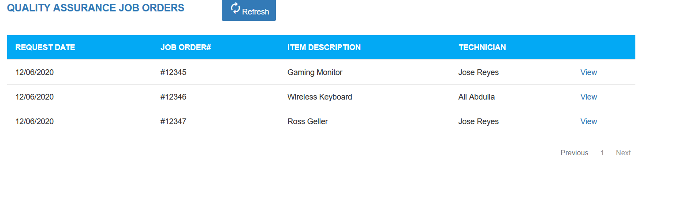

# Portfolio4

<!DOCTYPE html>
<html lang="en">
<head>
  <title>Marven Garcia | Web Developer</title>
  <meta charset="utf-8">
  <meta name="viewport" content="width=device-width, initial-scale=1">
  
  <link rel="preconnect" href="https://fonts.googleapis.com">
  <link rel="preconnect" href="https://fonts.gstatic.com" crossorigin>
  <link href="https://fonts.googleapis.com/css2?family=Roboto+Slab:wght@200;400;500&display=swap" rel="stylesheet"> 
  <link href="https://allfont.net/allfont.css?fonts=league-spartan" rel="stylesheet" type="text/css" />
  <link rel="stylesheet" href="https://maxcdn.bootstrapcdn.com/bootstrap/3.4.1/css/bootstrap.min.css">
  <link href="https://fonts.googleapis.com/css?family=Montserrat" rel="stylesheet">
  
  
  <link rel="stylesheet" href="https://cdnjs.cloudflare.com/ajax/libs/font-awesome/4.7.0/css/font-awesome.min.css">
  <link rel="preconnect" href="https://fonts.googleapis.com">
  <link rel="preconnect" href="https://fonts.gstatic.com" crossorigin>
  <link href="https://fonts.googleapis.com/css2?family=Poppins:wght@100&display=swap" rel="stylesheet"> 
  <link rel="preconnect" href="https://fonts.googleapis.com">
  <link rel="preconnect" href="https://fonts.gstatic.com" crossorigin>
  <link href="https://fonts.googleapis.com/css2?family=Poppins:wght@300&display=swap" rel="stylesheet">
  
</head>
<body>
<!-- Navbar -->

<!-- First Container -->

  

  <nav class="navbar navbar-default">
      

        <button type="button" class="navbar-toggle" data-toggle="collapse" data-target="#myNavbar">
          
          
                                  
        </button>
      

      

        <ul class="nav navbar-nav navbar-right">
          <li><a href="#AboutMe">About Me</a></li>
          <li><a href="#Work">My Projects</a></li>
          <li><a href="#ContactMe">Contact Me</a></li>
        </ul>
      

  </nav>

  

     
  

  

    <h1 class="margin" id="first"><strong>Hi! Im</strong></h1>
    <h1 class="margin" id="second"><strong>Marven</strong></h1>
    

    <h3>full-stack web developer | software developer</h3>
    <a href="Resume.pdf" target="_blank"><i class="fa fa-file" style="font-size:40px;color:#0072b1; padding-right: 1em;"></i></a>
    <a href="https://www.linkedin.com/in/rolan-marven-garcia-724bb6192/" target="_blank"><i class="fa fa-linkedin-square" style="font-size:48px;color:#0072b1"></i></a>

<!-- Second Container -->

  <a id="AboutMe"><h1 class="margin text-center"><strong>About Me</strong></h1></a>
  

  
<strong>A recent graduate of the University of the Fraser Valley. Finished with a Bachelors degree in Computer Information Systems. With knowledge and experience in creating websites using HTML, CSS, Bootstrap and JavaScript. Also has experience in Software Development with knowledge in programming languages such as Java, Python and C++.</strong>

  

  

    
<strong>Skills:</strong>

  

      <strong>HTML</strong>
    

     
    

      <strong>CSS</strong>
    

     
    

      <strong>JavaScript</strong>
    

     
    

      <strong>Bootstrap</strong>
    

     
    

      <strong>PHP</strong>
    

     
    

      <strong>SQL</strong>
    

     
    

      <strong>Java</strong>
    

     
    

      <strong>Python</strong>
    

     
    

      <strong>C++</strong>
    

     
    

      <strong>Problem-solving and Analytical Skills</strong>
    

     
    
    
    

<!-- Third Container (Grid) -->

    
  <a id="Work"><h1 class="margin text-center"><strong>Projects</strong></h1> </a>
  <h2 class="margin text-center"><strong>Website</strong></h2>
  

    

      

        <a href="https://sag.ufvsoca.ca/sag/2019/04/26/interpret-2019/" target="_blank">
          
      

    

    

      

        
      

    

    

      

        
      

    

  

  <h2 class="margin text-center"><strong>Digital Media</strong></h2>
  

    

      

        
      

    

    

      

        
      

    

    

      

        
      

    

  

 

  <a id="ContactMe"><h1><strong>Contact Me *Not Working At the Moment*</strong></h1></a>
  <form action="/action_page.php">
    <label for="fname">Name</label>
    <input type="text" id="name" name="fullname" placeholder="Your name..">

    <label for="lname">Email</label>
    <input type="text" id="email" name="email" placeholder="Your email..">

    <label for="subject">Message</label>
    <textarea id="subject" name="subject" placeholder="Write something.." style="height:200px"></textarea>

    <input type="submit" value="Submit">
  </form>

</body>
</html>
